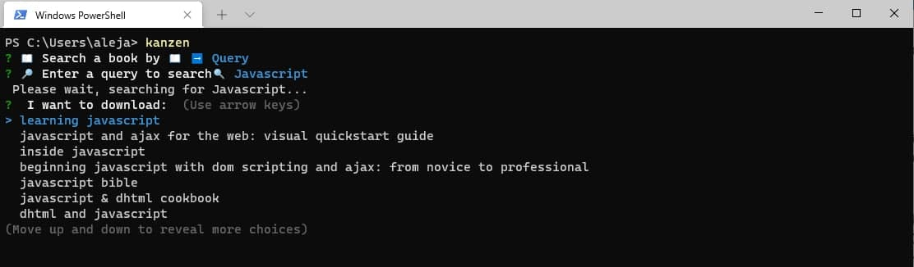
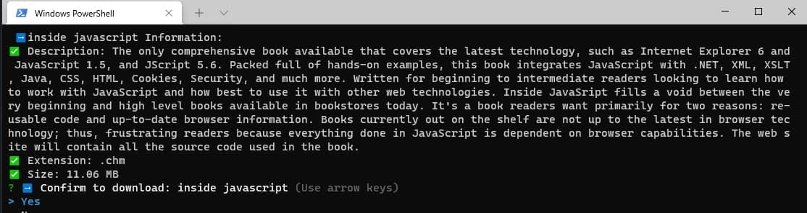
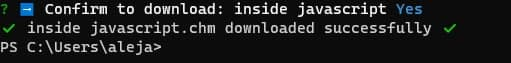

<h1 align="center">
  <br>
  <a href="https://github.com/alejandro0619" alt="Kanzen Wrapper" width="200"></a>
  <br>
  📚 Kanzen 📚
  <br>
</h1>

<h3 align="center">Kanzen (観禅) literally means perfection, this is exactly what this app is when it comes to downloading books.</h3>
   
----
## ⚠️ DISCLAIMER ⚠️
### [click here to read](./DISCLAIMER.md)
<br>

## WARNING
### __This application has been tested in Windows enviroments. I do not guarantee it will work on UNIX based systems__
----
<br>

## Sample of use 📕

      First step:


----

    Second step:


----

    Third step:

----

    It's easy as that. (keep reading for detailed explanation on how to use)
    
----

## How to use: step by step.
### Let's see how to download a Javascript book:
```bash
# Download it from directly from npm.
$ npm i -g kanzen
# Execute the CLI directly from your terminal:

$ Kanzen
# It will launch a minimalist interface, like this:

? 📖 Search a book by 📖 (Use arrow keys)
> ➡️ Query
  ⚠️ Exit the CLI

# Click Query and it will allow you to enter the query on which you want to base the search

? 📖 Search a book by 📖 ➡️ Query
? 🔎 Enter a query to search🔍

# I'll want to search books about javascript programming language
# So I write it and then I press enter

? 📖 Search a book by 📖 ➡️ Query
? 🔎 Enter a query to search🔍 javascript
 Please wait, searching for Javascript...
?  I want to download:  (Use arrow keys)
 learning javascript
  javascript and ajax for the web: visual quickstart guide
  inside javascript
  beginning javascript with dom scripting and ajax: from novice to professional
  > javascript bible
  javascript & dhtml cookbook
  dhtml and javascript
(Move up and down to reveal more choices)
# Move up and down with you arrows and press enter to search that book. I'll download javascript bible
 ➡️javascript bible Information:
✅ Extension: .pdf
✅ Size: 34.64 MB
? ➡️ Confirm to download: javascript bible (Use arrow keys)
> Yes
  No
#Press yes and the download will automatically start, it will create a folder on your desktop named Book which has inside the book you want.
```

## Download 💾


To clone and run this application, you'll need [Git](https://git-scm.com) and [Node.js](https://nodejs.org/en/download/) (which comes with [npm](http://npmjs.com)) installed on your computer. From your command line:

```bash
# Clone this repository
$ git clone https://github.com/alejandro0619/Kanzen-CLI

# Go into the repository
$ cd Kanzen-CLI

# Install dependencies
$ npm install

# Build
$ npm run build

# Run the app
$ npm run start

```

## Credits 📚

This software uses the following open source packages:
- [Libgen](https://www.npmjs.com/package/libgen#usage-choosing-a-mirror)
- [Axios](https://axios-http.com/)
- [Node.js](https://nodejs.org/)
- [Typescript](https://www.typescriptlang.org/)


## License 🔐
### The source code of this project is under the [MIT license](https://github.com/alejandro0619/Fixer-wrapper/blob/main/LICENSE) 

---
> Github [@alejandro0619](https://github.com/alejandro0619) &nbsp;&nbsp;
